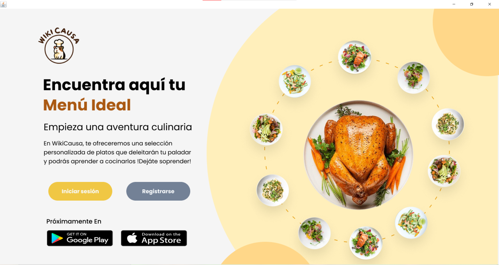
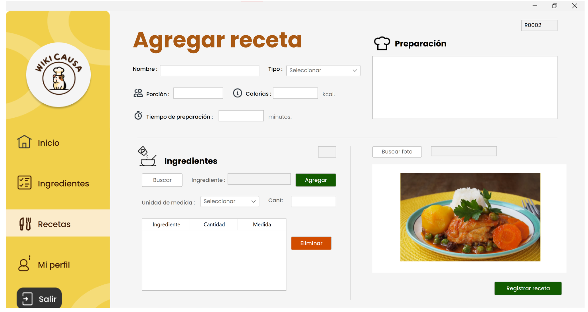
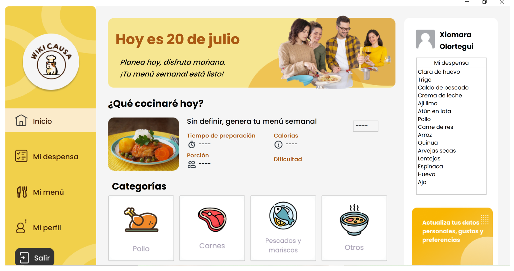
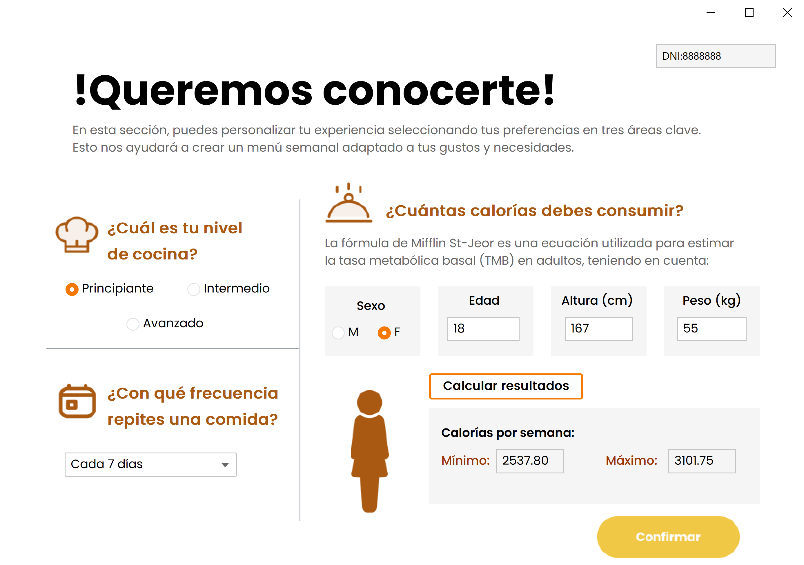
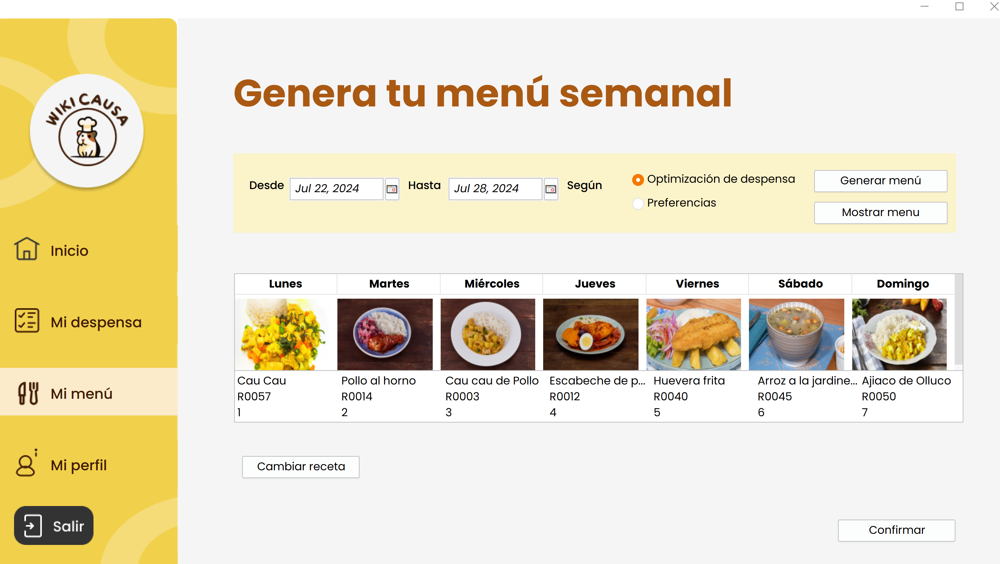
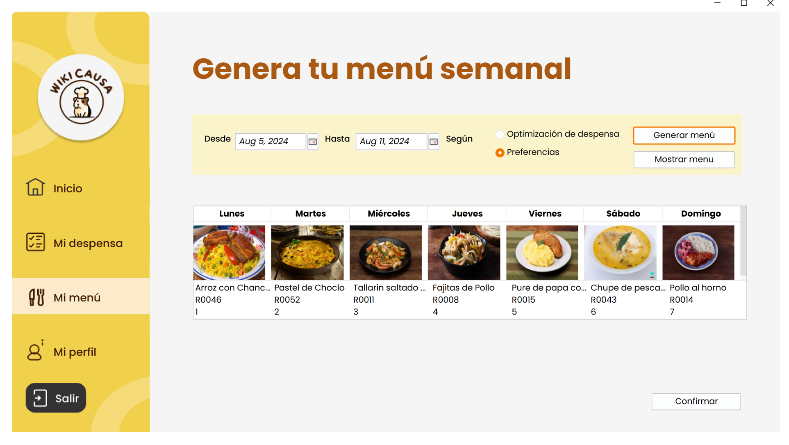
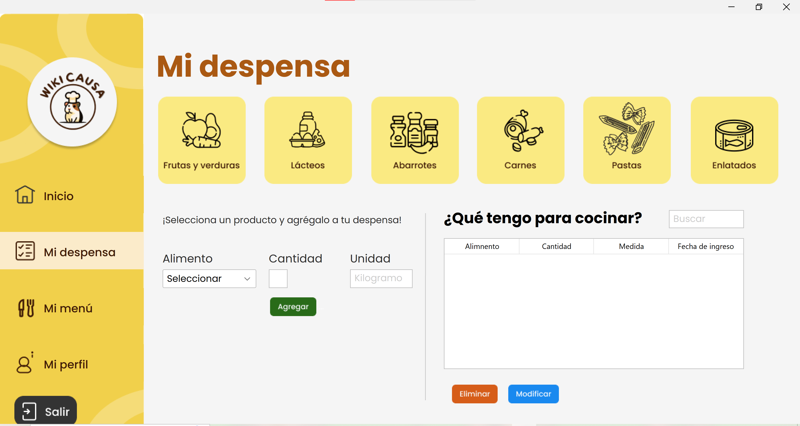

# 🍲 WikiCausa

### Your fridge already has dinner in it. You just don't know it yet.

---

## The story behind it

It started with a conversation that's probably happening in your kitchen right now: *"I have no idea what to cook with what's in here."*

Four of us kept hearing some version of that sentence from our moms: full fridges, zero time, and the same question every night. So we decided to stop complaining about it and build something instead: an app that looks at what you *already have* and tells you what to cook with it, instead of handing you another grocery list.

That's WikiCausa: an app that plans your entire week of meals around your actual pantry, or around your calorie goals, whichever you need more.

## What it does

- 📝 **Tells the app about you** — cooking skill level, how often you like to repeat meals, dietary restrictions, allergies.
- 🥫 **Reads your pantry** — you log what you have, it remembers.
- 🍽️ **Builds your week two ways**:
  - **By pantry** → maximizes what you already own, minimizes waste.
  - **By calories** → builds a menu inside the calorie range your profile calls for.
- 🔄 **Lets you swap a dish you don't like** — and the whole week reshuffles itself automatically.
- ✅ **Tracks what actually got cooked**, so the plan matches reality.


## Tech stack

| | |
|---|---|
| **Language** | Java |
| **Database** | MySQL |
| **Design** | Object-oriented, modular architecture |
| **Runs on** | Windows, Linux, macOS |

## See it in action

| | |
|---|---|
|  | Your dashboard — the dishes waiting for you this week. |
|  | Tell us how you cook, how often, and what you can't eat. |
|  | Menu generated from what's already in your kitchen. |
|  | Menu generated to fit your calorie range. |
|  | Manage what's in your pantry in real time. |

*(Full mockup set, class diagram, and DB schema in `/docs`.)*

## Getting started

```bash
git clone <repo-url>
cd wikicausa
# configure your MySQL connection in the config file
# build and run the Java project
```

## What's next

- Custom/user-submitted recipes, including dishes outside our current catalog.
- Smarter recommendations that learn from what users actually cook, not just what they plan.
- Support for dietary lifestyles we don't cover yet (vegan, vegetarian).

## The team

Built by four engineering students who got tired of hearing "what should I cook" and decided to make it someone else's problem, the algorithm's.

- Leslie Sanchez Mandujano
- Yosselin Altamirano Oyola
- Luis Paz Saavedra
- Omar Trejo Carranza
